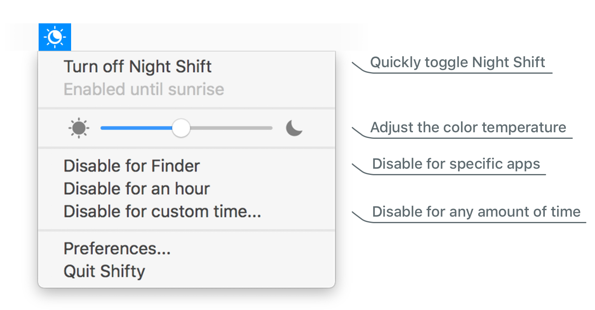
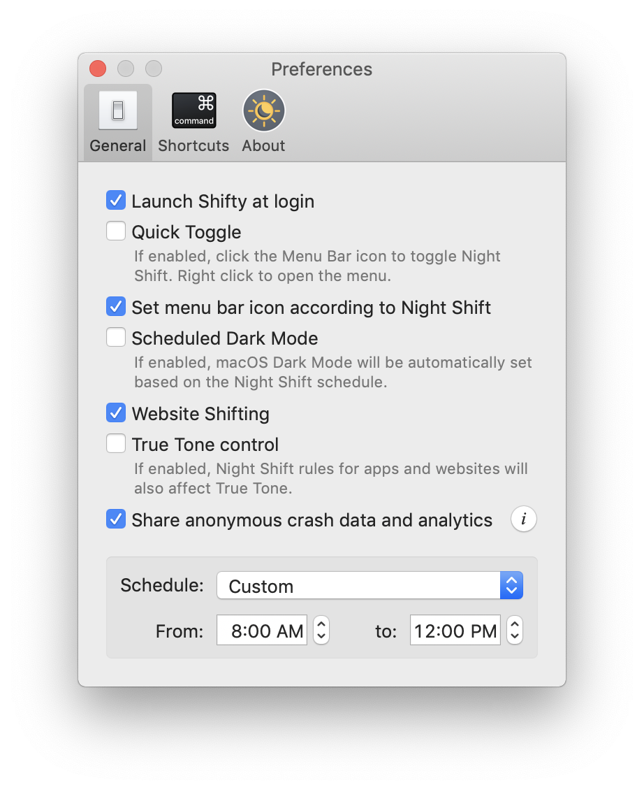

Shifty expands the capabilities of the built-in Night Shift feature in macOS. Disable Night Shift for specific apps, websites, and custom time periods, and fine-tune your color temperature with a convenient slider. Shifty is the foundation for a full circadian workspace experience — with planned support for automatic schedule-driven calibration, multi-display awareness, and ambient sensor integration.

Shifty is customizable! Use Quick Toggle to flip Night Shift from the menu bar, sync Dark Mode to your Night Shift schedule, and configure global keyboard shortcuts for common actions.

### System requirements:
* macOS 14 (Sonoma) or later
* System meets the [requirements for Night Shift](https://support.apple.com/en-us/HT207513#requirements)
* Website shifting supports Safari, Chrome, Chromium, Edge, Brave, Opera, Vivaldi, and their variants.

 
Shifty is free and open source, licensed under GPLv3. Feel free to make a pull request!

If you'd like to help translate Shifty into other languages, you can contribute [here](https://shifty.natethompson.io/translate).
