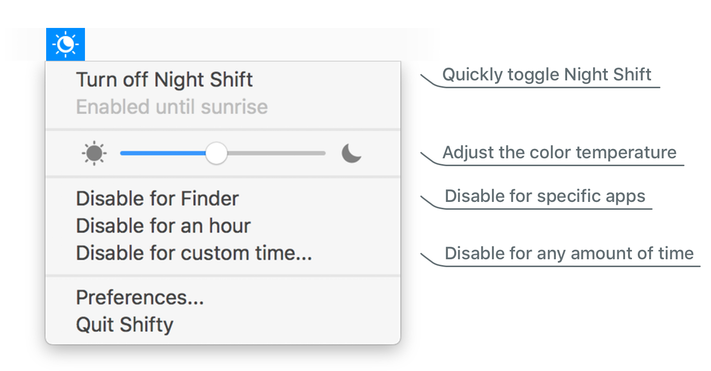
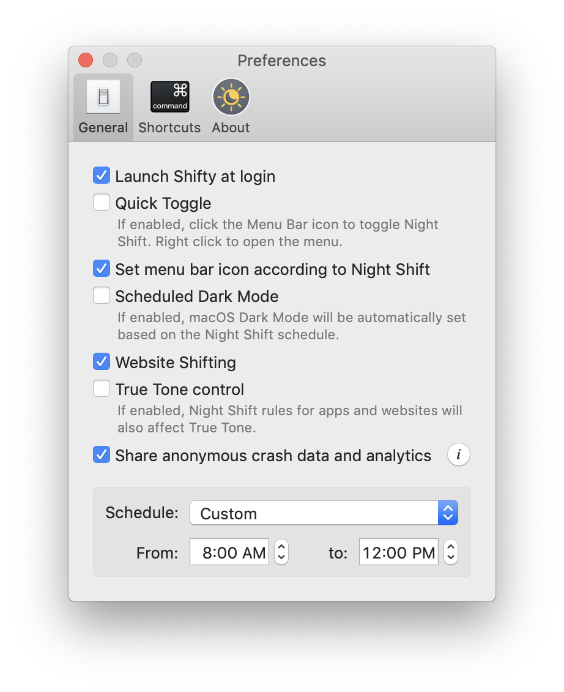

# Shifty

Shifty expands the built-in Night Shift feature in macOS. It can disable Night Shift for specific apps, websites and custom time periods, expose global keyboard shortcuts, synchronise Dark Mode, and fine-tune colour temperature from the menu bar.



Shifty is being modernised into a contextual circadian workspace optimiser. A three-phase scheduling foundation exists in the current codebase, but circadian scheduling, activity sensing, per-display calibration, App Intents and CLI tooling are not yet production-ready. The audited implementation status and delivery order live in [PLAN.md](PLAN.md).



## System requirements

- macOS 14 (Sonoma) or later.
- A Mac that supports [Night Shift](https://support.apple.com/en-us/HT207513#requirements).
- Accessibility and Automation permission for website shifting.
- Website shifting supports Safari, Chrome, Chromium, Edge, Brave, Opera, Vivaldi and their variants.

Shifty uses undocumented macOS display interfaces. Compatibility can change between macOS releases, so a successful build alone does not verify Night Shift or True Tone behaviour on every Mac.

## Development

Open `Shifty.xcodeproj` directly. Dependencies are managed with Swift Package Manager.

```sh
set -o pipefail
xcodebuild build -project Shifty.xcodeproj -scheme Shifty -destination 'platform=macOS' CODE_SIGNING_ALLOWED=NO | xcbeautify

set -o pipefail
xcodebuild test -project Shifty.xcodeproj -scheme Shifty -destination 'platform=macOS' CODE_SIGNING_ALLOWED=NO -only-testing:ShiftyTests | xcbeautify
```

Shifty is free and open source under the GPLv3 licence. Contributions are welcome.

If you'd like to help translate Shifty into other languages, you can contribute [here](https://shifty.natethompson.io/translate).
